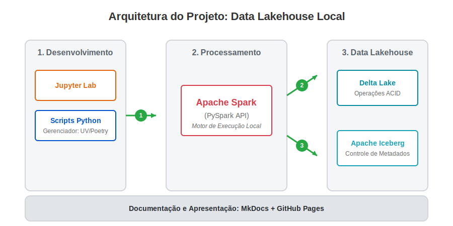

# Projeto de Engenharia de Dados - SATC

Repositório para desenvolvimento do projeto da disciplina de Engenharia de Dados do curso de Engenharia de Software da UNISATC. O objetivo principal é implementar e documentar uma pipeline de dados utilizando **Apache Spark**, com suporte às tecnologias de Data Lakehouse **Delta Lake** e **Apache Iceberg**.

## Desenho de Arquitetura

Abaixo está o diagrama arquitetural da pipeline desenvolvida para este projeto, mapeando o fluxo desde o ambiente de desenvolvimento até o armazenamento no Data Lakehouse.



**Fluxo de Dados:**
1. Os comandos DDL e DML são escritos em Python através do **Jupyter Lab**.
2. O **Apache Spark (PySpark)** interpreta os comandos e atua como o motor de processamento.
3. Os dados são persistidos localmente utilizando as camadas transacionais do **Delta Lake** e **Apache Iceberg**, garantindo operações ACID e versionamento.

---

## Pré-requisitos e ferramentas utilizadas

* **Linguagem:** Python 3.11+
* **Processamento de Dados:** Apache Spark (PySpark)
* **Formatos de Tabela (Lakehouse):** Delta Lake e Apache Iceberg
* **Ambiente de Desenvolvimento:** Jupyter Labs / Jupyter Notebook
* **Gerenciamento de Pacotes:** `uv` (ou Poetry)
* **Documentação:** MkDocs + mkdocstrings + mkdocs-material

---

## Instalação e Configuração do Ambiente

Siga o passo a passo abaixo para reproduzir o ambiente localmente.

### 1. Clonar o repositório

```
git clone https://github.com/brunomonteirobonifacio/projeto-engenharia-dados-satc.git
cd projeto-engenharia-dados-satc
'''

### 2. Configurar o ambiente virtual com uv
Crie o ambiente virtual, ative-o e instale as dependências (PySpark, Jupyter, MkDocs, etc.):

# Criar ambiente virtual

'''
uv venv
'''

# Ativar o ambiente (Linux/Mac)
'''
source .venv/bin/activate
'''

# Ativar o ambiente (Windows)
# .venv\Scripts\activate

# Instalar as dependências do projeto
'''uv sync'''

### 3. Executar o Jupyter Labs
Com o ambiente ativado e as bibliotecas instaladas, inicie o Jupyter para rodar os arquivos .ipynb:

'''
uv run jupyter lab
'''

Isso abrirá o Jupyter no seu navegador padrão. Acesse os arquivos referentes às implementações do Delta Lake e Apache Iceberg para ver os códigos (DDL, DML) em ação.

### Documentação (MkDocs)
Toda a documentação conceitual e a explicação das operações (INSERT, UPDATE, DELETE e Versionamento) está na pasta docs/.

Para construir a documentação estática:

'''
uv run mkdocs build
'''

Para rodar o servidor local e visualizar a documentação:

'''
uv run mkdocs serve
'''

###Publicação (Deploy)
A documentação está publicada via GitHub Pages. Para atualizar o site público após alguma alteração, utilize:
'''
uv run mkdocs gh-deploy
'''

### Colaboração
Abra uma Issue para discutir sua nova feature ou reportar um bug.

Crie uma Branch para a sua modificação:

'''
git checkout -b feature/nome-da-sua-feature
'''

Faça suas alterações e realize o commit seguindo o padrão Conventional Commits.
Envie um Pull Request para a branch main.
Aguarde revisão e merge.

### Versão

Utilizamos o SemVer para controle de versionamento.

Versão Atual: 1.0.0 - Entrega inicial do projeto da disciplina de Engenharia de Dados.

### Autores

Bruno Monteiro - Implementação Delta Lake e Spark - Perfil GitHub

Luis Filipe Damiani- Implementação Apache Iceberg e Notebooks - Perfil GitHub

Gianluca Andrade - Documentação MkDocs e Arquitetura - Perfil GitHub

### Licença
Este projeto está sob a licença MIT - veja o arquivo LICENSE.md para detalhes.

### Referências

Vídeos do canal DataWay BR

Repositório Base: spark-delta (Prof. Jorge Silva)

Repositório Base: spark-iceberg (Prof. Jorge Silva)

Material de Apoio: Python para Engenharia de Dados - material de apoio.pdf

Documentação Oficial do Apache Spark

Documentação Oficial do Delta Lake

Documentação Oficial do Apache Iceberg
